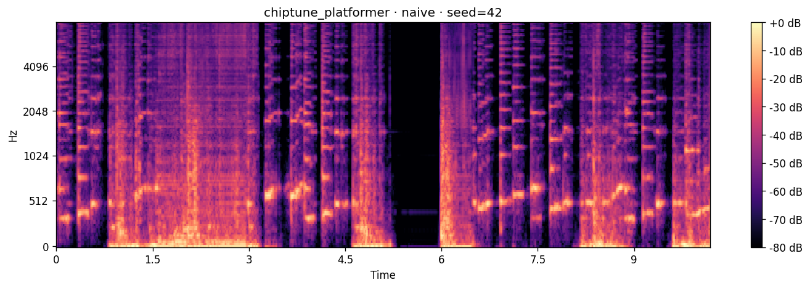
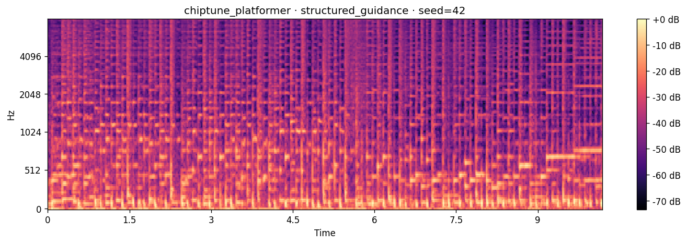

# Controlled Music & Sound Generation with MusicGen

**CS 5542 — Big Data Analytics · Quiz Challenge 2 · Spring 2026**

A study of prompt engineering, control mechanisms, and multi-metric
evaluation in text-to-audio foundation models — applied to the scenario
of game audio and content-creator background music generation.

---

## TL;DR

I built a controlled music generation pipeline on MusicGen Small. Five scene
specifications (gym workout pop, cinematic suspense, lo-fi study, chiptune
platformer, acoustic folk) are rendered under three progressively-controlled
prompt strategies and evaluated across five metrics. The central findings:

> **Structured prompts and higher classifier-free guidance dramatically
> improve audio-text alignment (raw CLAP 19.78 → 48.12), consistency
> (0.0485 → 0.0306 mel-spec distance), and tempo accuracy (median error
> 25.0 → 1.2 BPM) — at the cost of reduced diversity across scenes.
> The trade-off curve from Challenge 1 reproduces in audio.**
>
> **The CLIP prompt-length bias from Challenge 1 did NOT reproduce in
> CLAP — instead, CLAP favors detailed prompts. Metrics inherit biases
> from their training data, and those biases do not transfer cleanly
> across modalities.**

**Demo video:** [Watch on OneDrive](https://mailmissouri-my.sharepoint.com/:v:/g/personal/rahktf_umsystem_edu/IQARTgGewC4UT4b5t_-KIDOZAXOEayGFZzoyn-hp_DAH7j8?nav=eyJyZWZlcnJhbEluZm8iOnsicmVmZXJyYWxBcHAiOiJTdHJlYW1XZWJBcHAiLCJyZWZlcnJhbFZpZXciOiJTaGFyZURpYWxvZy1MaW5rIiwicmVmZXJyYWxBcHBQbGF0Zm9ybSI6IldlYiIsInJlZmVycmFsTW9kZSI6InZpZXcifX0%3D&e=zR5FTi)

---

## Hero Comparison

The chiptune_platformer scene under naive vs. fully-controlled prompting:

|  | Naive | Structured + Guidance |
|---|:---:|:---:|
| **Prompt** | `"8-bit chiptune"` | Full metadata + quality floor + CFG 5.0 |
| **Detected tempo** | 101 BPM (off by 49) | 150 BPM (exact) |
| **Raw CLAP** | 6.86 (near-zero) | 48.87 |
| **Spectrogram** |  |  |

The naive prompt produced generic electronic output that failed to match
the requested genre — chiptune is a niche style with sparse training
representation in MusicGen's corpus. The structured prompt provided
anchoring vocabulary (`square wave lead`, `triangle wave bass`,
`noise channel drums`, `NES-style`) that grounded the generation in the
correct sonic space.

---

## Results

Full evaluation across 45 generations (5 scenes × 3 strategies × 3 seeds):

### Alignment metrics (higher = better)

| Strategy              | Raw CLAP ↑     | Semantic CLAP ↑ |
|-----------------------|:--------------:|:---------------:|
| Naive                 | 19.78 ± 13.39  | 31.65 ± 15.49   |
| Structured            | 41.65 ± 8.80   | 45.25 ± 11.77   |
| **Structured+Guidance** | **48.12 ± 5.86** | **49.45 ± 7.83**    |

### Perceptual metrics

| Strategy              | Consistency ↓  | Diversity ↑    |
|-----------------------|:--------------:|:--------------:|
| Naive                 | 0.0485 ± 0.0200 | **0.0557 ± 0.0168** |
| **Structured**        | **0.0305 ± 0.0094** | 0.0404 ± 0.0114 |
| Structured+Guidance   | 0.0306 ± 0.0119 | 0.0379 ± 0.0137 |

### Tempo accuracy (|detected − target| BPM; lower = better)

| Strategy              | Mean   | Median | Max    |
|-----------------------|:------:|:------:|:------:|
| Naive                 | 31.65  | 25.00  | 81.20  |
| Structured            | 30.09  | 20.30  | 160.00 |
| **Structured+Guidance** | 20.82  | **1.20**   | 88.60  |

**Bold** marks the winning strategy per metric. Structured+Guidance wins every
alignment and tempo metric. Naive wins only on diversity — the expected control
vs. variability trade-off.

---

## Repository Layout

```
.
├── README.md                           this file
├── requirements.txt                    pinned dependencies
│
├── notebook/
│   ├── README.md                       run instructions
│   ├── cell_map.md                     notebook ↔ src/ traceability map
│   └── quiz_challenge_2.ipynb          end-to-end Colab notebook (source of truth)
│
├── src/                                clean Python modules
│   ├── scene_spec.py                   SceneSpec dataclass + 5-entry catalog
│   ├── prompts.py                      three prompt strategies
│   ├── generate.py                     MusicGen generation runner
│   └── evaluate.py                     all five metrics
│
├── slides/
│   └── quiz_challenge_2.pptx           presentation deck
│
├── results/
│   ├── evaluation_results.csv          summary metrics table
│   ├── full_metrics.json               detailed per-clip scores
│   ├── manifest.json                   per-clip metadata
│   ├── all_audio/                      45 generated WAV files
│   ├── sample_audio/                   9 curated hero clips
│   └── sample_spectrograms/            9 matching spectrograms
│
├── spectrograms/                       45 mel spectrograms (one per clip)
│
└── docs/
    └── failure_analysis.md             cataloged failure modes + lessons
```

---

## Quickstart (Google Colab)

The fastest path to reproducing these results is the bundled notebook,
designed for a Colab Pro GPU runtime.

1. Open `notebook/quiz_challenge_2.ipynb` in Google Colab.
2. Select `Runtime → Change runtime type → T4 GPU` (or L4 / A100).
3. Run cells top-to-bottom. Expect ~15 minutes end-to-end on L4.

**Important dependency note**: the notebook pins `numpy>=1.26,<2.0` because
librosa's numba dependency is not yet numpy-2-compatible as of April 2026.
A runtime restart is required after the pin takes effect. The notebook
handles this in Cell 1.

---

## Quickstart (Local, Python API)

If you have a local GPU you can run the modules directly.

```bash
git clone git@github.com:rohanhashmi2/cs5542-quiz-challenge-2.git
cd quiz_challenge_2
pip install -r requirements.txt
```

```python
from pathlib import Path
from src.scene_spec import CATALOG
from src.prompts import STRATEGIES
from src.generate import load_pipeline, run_generation_suite
from src.evaluate import evaluate_all

# 1. Generate
model, processor = load_pipeline()
manifest = run_generation_suite(
    model=model,
    processor=processor,
    catalog=CATALOG,
    strategies=STRATEGIES,
    seeds=[42, 123, 2024],
    output_dir=Path("my_generations"),
)

# 2. Evaluate — returns a nested dict with all 5 metrics
metrics = evaluate_all(
    manifest_path=Path("my_generations/manifest.json"),
    generations_dir=Path("my_generations"),
    catalog=CATALOG,
)
print(metrics)
```

---

## Methodology

### 1. Structured metadata schema

Every audio scene is defined by a `SceneSpec` dataclass — scene ID, use case,
genre, target BPM, instruments, mood, and key descriptors. This mirrors what
a real game-audio or content-creator platform would receive from a user
brief. The catalog contains five entries spanning genres with different
degrees of training-data familiarity; see [`src/scene_spec.py`](src/scene_spec.py).

### 2. Three prompt strategies

All three take the same `SceneSpec` as input. The difference is how much
of that metadata reaches the model:

- **Naive** — bare genre, e.g. `"8-bit chiptune"`. The lazy-user baseline.
- **Structured** — template compiles every field with production modifiers.
- **Structured + Guidance** — same positive prompt, plus quality-floor tokens
  (`"clean mix, no distortion, no vocals, no clipping"`), plus raised
  classifier-free guidance scale (5.0 vs default 3.0).

**Why "Guidance" and not "Negative"**: MusicGen is an autoregressive
transformer, not a diffusion model — it has no mechanism for negative
prompts. See [`docs/failure_analysis.md`](docs/failure_analysis.md#failure-4-no-true-negative-prompt-mechanism-in-musicgen)
for the full explanation. This is Challenge 2's architectural adaptation
of Challenge 1's "structured + negative" strategy.

### 3. Reproducible generation

45 clips total: 5 scenes × 3 strategies × 3 seeds. Seeds are held fixed
across strategies, so any clip can be compared against any other with
noise held constant. 10-second clips at 32 kHz, MusicGen Small in fp16
on CUDA.

### 4. Five-metric evaluation

| Metric | Direction | Measures |
|---|:---:|---|
| Raw CLAP | ↑ | Audio ↔ full prompt text similarity (LAION-CLAP) |
| Semantic CLAP | ↑ | Audio ↔ canonical scene description (controls for prompt length) |
| Consistency | ↓ | Mel-spec cosine distance within scene across seeds |
| Diversity | ↑ | Mel-spec cosine distance across different scenes |
| Tempo accuracy | ↓ | \|detected BPM − target BPM\| — mean AND median reported |

CLAP provides the CLIP-equivalent audio-text alignment. Mel-spectrogram
cosine distance is the LPIPS-equivalent perceptual similarity (FID has no
well-established audio analog at n=45 and was dropped). Tempo accuracy
is the one objective, physics-based metric — measurable with a clock
rather than a learned network.

---

## Findings

### Finding 1 — Structured prompts win alignment and tempo; naive wins diversity

Structured+Guidance achieved raw CLAP 48.12 (vs naive 19.78 — a 2.4× gap),
median tempo error of 1.2 BPM (vs naive 25.0 — over 20× better), and the
lowest variance across all three alignment measurements.

The same control-diversity trade-off observed in Challenge 1 (image
generation) reproduces in Challenge 2 (audio generation): naive prompts
produced the most varied outputs across different scenes, but at the cost
of poor alignment to any specific scene concept.

### Finding 2 — CLAP favors detail; CLIP disfavors length

In Challenge 1, raw CLIP exhibited prompt-length bias that favored naive
prompts — an artifact I fixed by introducing semantic CLIP. In Challenge 2,
I expected to reproduce this finding. Instead, raw CLAP already favored
detailed prompts by a large margin (41.65 vs 19.78).

**The metrics inherit biases from their training distributions.** CLIP was
trained on mixed-length web captions; CLAP was trained on detailed music
captions. Semantic CLAP still narrowed the gap (from 28 points to 17
points, showing some residual length effect) but never flipped the ranking.

**The generalizable lesson — reporting multiple alignment metrics is
essential — is the same across modalities. The specific bias you are
guarding against is not.**

### Finding 3 — Architectural control mechanisms do not transfer

MusicGen does not support negative prompts. Challenge 1's "structured +
negative" strategy had to be re-derived for Challenge 2 as "structured +
guidance" — raising classifier-free guidance scale and appending
quality-floor tokens.

This means **methodology ported across modalities requires understanding
of the underlying architectures**. You cannot mechanically copy "three
prompt strategies" from image to audio and expect the third strategy to
work unchanged.

### Finding 4 — Beat tracker failure on sparse audio

Librosa's beat tracker produced systematic 2× errors on the
cinematic_suspense scene (detected 178.6 or 250 BPM when target was 90 BPM).
This is a measurement failure, not a generation failure — beat tracking
algorithms assume locked drum-driven pulses that sparse orchestral music
does not provide.

Reporting **both mean and median** tempo error surfaces this: the mean
is dominated by outliers, while median error for structured+guidance is
1.2 BPM — an honest picture of typical performance. This is the same
methodology discipline as Challenge 1's semantic CLIP fix, applied
one layer deeper: even within a single metric, the aggregation choice
matters.

See [`docs/failure_analysis.md`](docs/failure_analysis.md) for specific
failure modes and their attributions.

---

## Limitations & Future Work

**Reproducibility caveat for CLAP.** Running the full pipeline twice
produced bit-for-bit identical tempo/consistency/diversity metrics, but
CLAP scores varied by up to 0.9 points (≤2%) due to CLAP's non-deterministic
CUDA operations. Rankings were stable across runs.

**Small sample size.** 45 clips total is sufficient for directional
findings but not for proper significance testing. Scaling to hundreds of
seeds per scene would tighten confidence intervals.

**No FID analog reported.** Audio has no well-established distributional
metric that works at small sample sizes. Fréchet Audio Distance (FAD)
exists but inherits FID's size requirements.

**Beat tracker unreliability on sparse music.** A neural beat tracker
would handle cinematic/free-time audio more robustly than librosa's
onset-based approach.

**Single model tested.** Stable Audio Open, AudioLDM2, and MusicGen
Medium/Large would likely produce different results — especially on
niche genres like chiptune. Comparative study is future work.

---

## Tools & Technologies

| Component | Choice |
|---|---|
| Base model | MusicGen Small (`facebook/musicgen-small`) |
| Framework | Hugging Face Transformers |
| Audio eval | LAION-CLAP, librosa, scipy |
| Compute | NVIDIA L4 GPU (Google Colab Pro) |
| Language | Python 3.12, PyTorch 2.x |

---

## AI Assistance Disclosure

This project was built in collaboration with **Claude (Anthropic)** as a
pair-programming assistant. Claude was used for:

- Debugging Colab dependency conflicts (numpy/numba/librosa version pinning)
- Structuring the evaluation pipeline and identifying CLAP's training-data bias
- Diagnosing librosa beat tracker failures on sparse audio
- Designing the "structured + guidance" strategy as the MusicGen analog of
  Challenge 1's "structured + negative"
- Designing the presentation slide structure (parallel to Challenge 1)

All code was reviewed and executed by the author. All audio was generated
by the author's Colab notebook. All experimental results were computed
from first-principles Python code. All analytical conclusions — including
the CLAP-vs-CLIP bias difference, the architectural-transfer finding,
and the beat-tracker outlier diagnosis — were produced through human-AI
collaboration and verified against the underlying data.

---